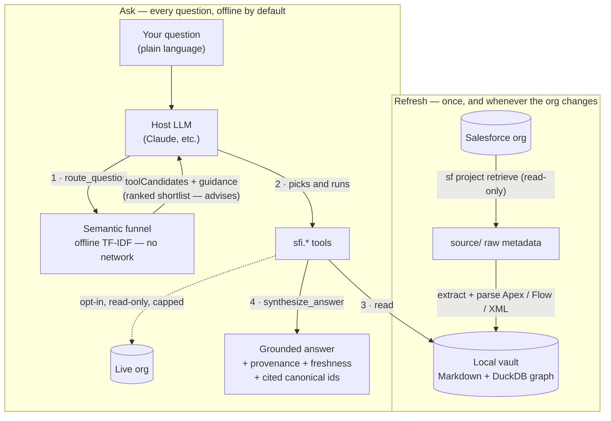

<p align="center">
  
</p>

<p align="center">
  <a href="./LICENSE"></a>
  <a href="https://www.npmjs.com/package/sf-intelligence"></a>
  <a href="https://github.com/PranavNagrecha/Salesforce-Intelligence/actions/workflows/ci.yml"></a>
  = 20">
  
</p>

# sf-intelligence

Ask questions about your Salesforce org in plain language — and get answers
grounded in the org's **real metadata**, not a guess.

`sf-intelligence` is an **offline, read-only, MCP-first knowledge base** for a
single Salesforce org. You run one retrieve (`sf project retrieve`); it builds a
local Markdown vault and a DuckDB dependency graph. From then on every answer is
served locally by default — **offline-first, no network egress for vault
answers.** An **opt-in live read-only plane** (`sfi.live_*`) can answer record
counts and samples when enabled. Private by design. MIT + Commons Clause.

## Ask it like a person

You don't need to know the exact API name of anything. The front door is a
**typo-tolerant resolver** that turns messy phrasing into the right component —
and when it isn't sure, it **asks you a clarifying question** instead of
guessing:

> **You:** where's the emale field?
>
> **It:** I found several matches for "email" — which did you mean?
> · `Email__c` on `Account`
> · `Email__c` on `Contact`
> · `Alternate_Email__c` on `Lead`

> **You:** what about the paymnet object?
>
> **It:** `Payment__c` — one confident match.

> **You:** is there a "warranty fee" field?
>
> **It:** Nothing matched that confidently. Your vault was last refreshed on
> 2026-05-20 — want to pull fresh metadata from the org (`/sfi-refresh`) in case
> it's new, or rephrase?

That is the headline behavior for **resolution and routing**: **they never
silently commit to a guess.** Resolution is always heuristic and labeled as
such. When several components are plausible it hands you a clarifying question;
when nothing matches it offers to refresh from the org or stop. A high match
score is string similarity, not proof. **Source grep tools** (`sfi.search_apex_source`,
`sfi.search_flow_metadata`) walk the vaulted `source/` tree from your last
refresh — run `/sfi-refresh` before trusting an empty grep result.

Under the hood a semantic **router** (`sfi.route_question`) reads each question
and returns a **meaning-ranked shortlist** of the `sfi.*` tools that can answer
it — so your AI host picks and runs them without you ever typing a tool name. It
runs fully **offline** (a small TF-IDF model over the tool catalog — no network,
no embeddings service) and it **advises rather than dictates**: the host LLM sees
the shortlist plus a short planner contract and decides which tools to run, in
what order. The router also tags each question with the plane that answers it —
the **offline vault** (metadata, dependencies, permissions), the **live org**
(counts, samples, limits, inactive users — read-only, opt-in), or a **hybrid** of
both (e.g. "is this field *actually* populated?"). Every answer is stamped with
its provenance (`offline_snapshot`, `live_org`, or `hybrid`) and freshness. When
nothing fits, it **says so and logs the gap** rather than guessing — so the
library grows toward what people actually ask. (A deterministic, no-LLM routing
mode is available via `SFI_ROUTER_MODE=offline` for CI / air-gapped hosts.)

## How it works

One read-only **refresh** turns your org into a local vault; from then on every
question is answered **offline** — your AI host asks the router for a shortlist,
picks the tools, runs them against the vault, and grounds the answer. The host
decides; the router only advises.



Every box on the **Ask** path runs on your machine; the dotted edge to the live
org is the only one that can touch Salesforce, and only after you opt in. The
deterministic `SFI_ROUTER_MODE=offline` mode collapses step 1 to a single routed
plan for hosts with no LLM in the loop.

## What you can ask

Eight capability areas, each answerable in natural language (ask
`sfi.capabilities`, or just "what can you do?", for the live map):

| Area | Example questions |
| --- | --- |
| **Find & identify** | "where is the email field?" · "what's the payment object called?" |
| **Understand** | "what does this validation rule do?" · "what happens when an Account is saved?" (automation on standard objects works even when the object file was not retrieved; `objectModeled: false` is surfaced) |
| **Impact & dependencies** | "what breaks if I delete this field?" · "is it safe to deactivate this flow?" |
| **Permissions & sharing** | "why can't this user see this record?" · "who can edit the Salary field?" |
| **Automation & code** | "what runs on Case create?" · "which Apex methods have no real test coverage?" |
| **Decision-support (before you build/change)** | "before I add automation to this object, what already runs there?" · "building Apex here — what should I watch out for?" · "before I change/require this field, what breaks?" |
| **Architect & developer** | "are there circular Apex dependencies?" · "which classes have no test reference?" · "does the vault still match the live org?" |
| **Integrations** | "what external systems does this org talk to?" · "list every outbound endpoint" |
| **Documentation** | "give me a tour of this org" · "generate a data dictionary" |
| **Health & audit** | "is my vault fresh?" · "where is PII stored?" · "how has the org changed across refreshes?" |

These are **advisory, read-only briefings** — e.g. `automation_build_advisor`,
`apex_build_advisor`, `field_change_advisor` synthesize what the org already
shows so you make a better build decision; `find_dependency_cycles`,
`apex_test_coverage`, `live_drift_check`, and `org_history` serve architects and
developers. None of them write to the org.

Every org artifact the product names is backed by a tool call and cited with its
canonical ID (`CustomObject:Account`, `CustomField:Account.Industry__c`), and
every relationship is cited with its confidence (`declared`, `parsed`, or
`heuristic`).

## Trust & confidence glossary

Every answer is tagged so you know how much to lean on it. These tags match the
runtime values verbatim (the `trust` block on analysis tools, the per-edge
`confidence`, and `synthesize_answer`'s `provenance.stamp`).

**Confidence** — how a relationship or finding was derived:

- `declared` — Salesforce metadata states it directly (a layout assignment, a
  field's `referenceTo`, a permission grant). Highest trust.
- `parsed` — produced by AST/XML parsing of source (the **parser-grade Apex
  pass that runs on every refresh by default** — resolved field reads/writes,
  cross-class calls, field-level SOQL — plus the formula tokenizer, Flow
  elements, a profile's `<layoutAssignments>`). High trust.
- `heuristic` — produced by regex / token / dynamic-string analysis (the Apex
  recall scanner that supplements the parsed pass, name-pattern detection). May
  have false positives — spot-check before acting.

**Provenance** — where the answer came from:

- `offline_snapshot` — the last `/sfi-refresh` vault. The default for every vault
  tool.
- `live_org` — an opt-in, capped, read-only `sfi.live_*` SOQL read.
- `hybrid` — fuses vault + live and discloses both provenances.

**Completeness** — how much of what the answer depends on was actually retrieved:

- `complete` — the refresh modeled every metadata family the answer needs.
- `partial` — a family the answer depends on was not retrieved; absence means
  "not checked", never "none" (a `coverageCaveat` names the gap).
- `unknown` — coverage could not be determined.

Two tools make this concrete. `sfi.coverage_report` lists what the retrieve
manifest *requested and returned*; `sfi.retrieve_blindspot_report` lists what the
graph *references but never retrieved* — automation/code/config that depends on a
component the vault never pulled — so an "X is unused / nothing references X"
answer carries a known-coverage caveat instead of a silent blind spot.

## How much it models

| | |
| --- | --- |
| **MCP roster** | Every `sfi.*` tool is registered in code; run `sfi.capabilities` for the live count and workflow map |
| **Graph model** | A broad `ComponentType` union (objects, fields, Flows, Apex, layouts, permissions, sharing, UI, legacy automation, integrations, CPQ, OmniStudio, reports, FlexiPages, and more) connected by typed edges — see `sfi.capabilities` for how tools group those families |
| **25** | skills + **4** slash commands (Claude Code plugin layer) that auto-activate in a session |

## What it does NOT do

Boundaries are explicit, and the product tells you plainly when it hits one
rather than papering over the gap with general Salesforce knowledge:

- **Offline by default.** Vault tools never call Salesforce mid-conversation.
  Run `/sfi-refresh` to update metadata. **Opt-in live tools** (`sfi.live_*`)
  run read-only SOQL with strict caps and label answers `provenance: live_org`.
  The live plane is **off until you enable it once per org** — grant standing
  consent with `sfi.live_consent { grant: true }` (read-only, persists), or set
  `SFI_LIVE_PLANE_ENABLED=1`, or pass `liveEnabled: true` for a single call.
  **Hybrid** answers fuse vault + live and disclose both provenances. Live never
  backfills stale vault claims, and the product never auto-picks which org to
  query.
- **No record-level data.** The vault stores schema and source, not rows. "How
  many Opportunities closed last quarter" is a question for your org directly.
- **Static analysis, not runtime.** Dependency edges are derived from metadata
  and source. Dynamic SOQL, reflective Apex, and runtime metadata lookups are
  invisible to static analysis — a "no references found" result means "no static
  evidence", not "definitely unused".
- **Read-only.** The product never writes to your org. It has no write path.
- **Tested scale (CI budgets).** Three separate ceilings are gated in CI:
  - **Graph import:** 10,000 nodes in &lt;90s (`packages/graph/test/scale-import.test.ts`, `SCALE_IMPORT_BUDGET_MS`).
  - **Full refresh:** 1,000 `CustomObject`+`CustomField` files by default in &lt;10m (`packages/cli/test/scale-refresh.test.ts`, `SCALE_REFRESH_FIELD_COUNT`, `SCALE_REFRESH_BUDGET_MS`).
  - **Resolve:** p95 under 2s on the CI vault (`pnpm eval:scale`, `SCALE_BUDGET_MS`).
  Very large production orgs may still need narrowed retrieves or multiple vaults.

## Try it now — no Salesforce org needed

Want to see it work before pointing it at your own org? One command serves a
built-in **synthetic demo org** ("Verdant Energy," a fictional solar installer)
over MCP — fully offline, no auth, no `sf` CLI:

```bash
# Register the demo server with Claude Code (or any MCP client):
claude mcp add --transport stdio --scope user sf-intelligence-demo -- npx -y sf-intelligence demo
```

Then ask it things like:

> - *What happens when I save a Project?*
> - *What breaks if I delete `Invoice__c.Amount__c`?*
> - *Why can't an Installer see an Invoice?*
> - *Which Apex has governor-limit risk?*

The first run builds the demo vault in a few seconds (cached under
`~/.sf-intelligence/demo`); every run after is instant. Nothing leaves your
machine. When you're ready for your real org, follow **Install** below.

## Install

`sf-intelligence` is distributed on npm as `sf-intelligence` — an MCP
server plus the `sfi` command-line tool. Register the server with your MCP
client once, then drive everything through `sfi` (or, inside Claude Code, the
`/sfi-*` slash commands that wrap it).

**Requirements:** [Node.js 20+](https://nodejs.org) and an authenticated
[Salesforce CLI](https://developer.salesforce.com/tools/salesforcecli) (`sf`)
pointed at the org you want to vault. `npx` fetches everything else.

### Register the MCP server

**Claude Code** — from your Salesforce DX repo, add it project-scoped (writes a
`.mcp.json` at the repo root that your team can commit):

```sh
claude mcp add --transport stdio --scope project sf-intelligence -- npx -y sf-intelligence mcp
```

**Claude Desktop, or any other MCP client** — add this block to the client's MCP
config (Claude Desktop on macOS lives at
`~/Library/Application Support/Claude/claude_desktop_config.json`):

```json
{
  "mcpServers": {
    "sf-intelligence": {
      "type": "stdio",
      "command": "npx",
      "args": ["-y", "sf-intelligence", "mcp"]
    }
  }
}
```

Restart the client. The `sfi.*` tools are now available — ask `sfi.capabilities`
for the live tool map.

> **Tip:** `npm install -g sf-intelligence` puts an `sfi` command on your
> PATH, so first-run setup is `sfi init` / `sfi refresh` instead of the longer
> `npx -y sf-intelligence …` form.

## First run

Work from **your per-org repository** — the Salesforce DX project you want to
vault (the directory with `sfdx-project.json`). The first refresh is read-only:
it retrieves metadata and builds a local knowledge base; it never deploys or
mutates Salesforce data.

```sh
# 0. New here? The guided path walks install → auth → init → refresh → ask,
#    with real starter questions at the end.
sfi quickstart

# 1. Create the local org-kb/ vault layout and record which sf org alias to use.
sfi init

# 2. Retrieve metadata and build the vault.
sfi refresh --target-org my-org-alias

# 3. Confirm vault freshness, source-tree hash, and component counts any time.
sfi status

# sfi doctor checks the sf CLI, the vault, target-org auth, freshness, and the
# graph file, and prints an actionable fix for each problem.
sfi doctor
```

**How long does a refresh take?** A small sandbox builds in a few minutes; a
production-scale org is typically **~10–12 minutes** under the defaults — the
retrieve dominates, and the default build also runs the parser-grade Apex pass
(seconds per few hundred classes) and pulls the **top 500 reports/dashboards by
actual usage** (a minute or two on report-heavy orgs; `--no-reports` skips it).
In a hurry on a big org? `sfi refresh --staged` serves a skeleton vault in
seconds and the ten priority metadata families within minutes, then finishes
the full build behind the scenes — see the
[first-refresh guide](./docs/guides/first-refresh.md). Re-refreshes re-extract
by default (results always match a cold build); `--incremental` reuses the
per-file parse cache for the same result, faster.

No global install? Prefix each with `npx -y sf-intelligence`, e.g.
`npx -y sf-intelligence init`.

Then ask anything the vault can answer, in whatever MCP client you registered:

> What fields does the Account object have?
>
> What breaks if I delete `CustomField:Account.Industry__c`?
>
> Why can't the Standard User profile see Opportunities?
>
> Give me a tour of this org.

**Running sf-intelligence as a Claude Code plugin?** The same operations are
available as slash commands — `/sfi-onboard` (guided first run), `/sfi-init`,
`/sfi-refresh`, `/sfi-status` — and the coaching skills auto-activate when
Salesforce vocabulary appears.

### Serve it over HTTP (read-only)

`sfi mcp` is the stdio server your MCP client launches. To share one vault with
other machines or clients, the same server speaks streamable HTTP:

```sh
# From the vault directory: prints a bearer token once, listens on 127.0.0.1:8787.
sfi serve --http --generate-token
```

The remote posture is deliberately strict: a bearer token is required on every
request, the bind is loopback unless you pass `--host` (a non-loopback host
warns and refuses to run tokenless), and the **live plane is hard-disabled over
HTTP** — a remote caller can never spend your Salesforce API budget, even if
the host has standing live consent. A refresh underneath a running server is
safe: readers keep answering from the old graph until the new one swaps in.

### Give the vault a memory

```sh
# One-time, from the vault directory: inits a git repo INSIDE org-kb/
# (rebuildable surfaces like graph/ and snapshots/ are gitignored).
sfi vault git enable
```

From then on every refresh commits the vault's source and rendered Markdown, so
"**when did this component change?**" (`sfi.component_history` — one timeline
entry per source-changing refresh) and "**what did it look like before?**"
(`sfi.component_as_of`) become answerable from the vault's own history. A vault
without git answers those honestly (`available: false` plus this enable hint) —
never an error.

## Privacy

Everything stays on your machine. The vault (`org-kb/`) is local; the MCP server
makes no network calls while answering. This public repository ships **zero org
data** — a release privacy guard scans the shipping set on every release and
fails the build if a real org identifier leaks. What you vault is yours.

## Roadmap

The product is read-only today by design; that is the major axis of future work.

- **Deeper code resolution.** Parsed Apex call edges carry the called method
  names today; the remaining composite tools still reason at class granularity —
  method-level reachability across them is the next step.
- **A careful write side.** A small, opt-in set of *proposal* tools (e.g. draft a
  permission-set diff or a validation-rule edit for human review) once the read
  side is mature. The default will always be read-only.

(Earlier roadmap entries shipped: Tooling-API-backed stale-vault detection is
now the `sfi watch` daemon + drift badges; remote read-only serving is
`sfi serve --http`.)

## Feedback

A weak or wrong answer, or a question it couldn't route? That's the most useful
thing you can send back. It's captured **locally** — nothing phones home:

```sh
sfi feedback mark "where is the SSN field used" --wrong   # or --weak
sfi feedback export                                       # → sfi-feedback.json (scrubbed)
```

`sfi feedback export` bundles the local route-gap log plus your ratings into one
file with org PII (emails, URLs, record ids) stripped — component/api names are
kept because they're the signal. Exports are **scoped to the current vault by
default**: the log file is machine-global (`~/.sf-intelligence/`), but each gap
is stamped with the vault it was asked against, and only the current vault's
gaps are exported (the file reports how many were excluded). `--all` exports
the whole machine-global log — review it before sharing if you work across
multiple orgs. Share it (or just describe the gap) at
<https://github.com/PranavNagrecha/Salesforce-Intelligence/issues>.

## License

`sf-intelligence` is licensed under the **MIT License with the [Commons Clause](./LICENSE)** (see also [`NOTICE`](./NOTICE)). In plain English:

- ✅ **Free to use for any purpose — including at work, inside a company.** Evaluate, study, modify, self-host for your own use, fork, redistribute, and contribute — all free.
- 🚫 **You may not _Sell_ it without a commercial license** — i.e. provide it to third parties, for a fee, as a product or service whose value derives substantially from the Software. That includes offering it (or a hosted / SaaS / derivative version) as a paid product or service, reselling it or paid access to it, or charging for hosting/support whose value derives substantially from it.

For a commercial ("Sell") license, contact **pranav.sfintelligence@gmail.com**. _(Plain-English summary; the [LICENSE](./LICENSE) controls. Not legal advice.)_

## Documentation

- [Documentation index](./docs/README.md) — guides, architecture, configuration
- [Contributing](./CONTRIBUTING.md) · [Security](./SECURITY.md)

The build harness (a sibling repo, separate from this product) vendors Addy
Osmani's [`agent-skills`](https://github.com/addyosmani/agent-skills) under MIT.
Copyright (c) Addy Osmani; full MIT license text travels with the harness. None
of that content is redistributed in this product directory; the attribution is
recorded here for completeness.
